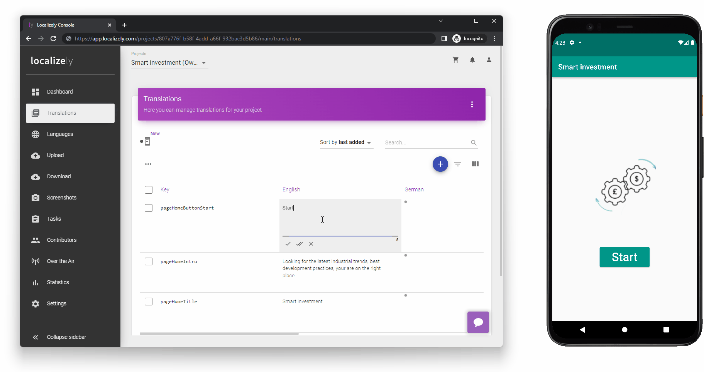

# Flutter In-Context Editing example

Instantly see how your translations fit on a real device without unnecessary app builds

## Setup

- Clone the repo
- Run `flutter pub get` command
- Create a new project on the [Localizely](https://localizely.com) platform and upload ARB files from the `lib\l10n` folder
- Run the app on a real device
- Connect with Localizely by entering the token
- Translate messages on Localizely and check while you type how they fit on a device

## Useful links:

- [In-Context Editing documentation](https://localizely.com/flutter-in-context-editing/)
- [In-Context Editing example with gen_l10n](https://github.com/localizely/flutter-in-context-editing-example/tree/main/)